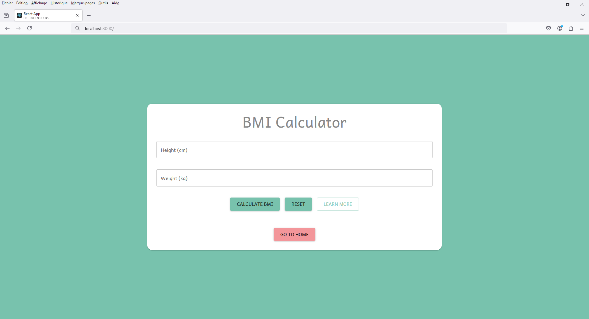

# HealthCalc

HealthCalc est une application de santé tout-en-un qui offre divers outils pour calculer l'IMC, le TMB, le ratio taille/hanche, les besoins en hydratation, la masse grasse, le risque cardiaque, les calories brûlées, les zones de fréquence cardiaque, la date d'accouchement, les besoins caloriques, et les gains musculaires.

## Screenshots





*Écran d'accueil de HealthCalc avec accès rapide aux différents calculateurs de santé.*


*Calculateur de besoins en hydratation pour maintenir une hydratation optimale.*

## Features

- **Calculateur d'IMC** : Évaluez votre indice de masse corporelle en fonction de votre poids et de votre taille.
- **Calculateur de TMB** : Calculez votre taux métabolique de base pour connaître vos besoins énergétiques au repos.
- **Ratio taille/hanche** : Mesurez le risque de maladies cardiovasculaires basé sur le rapport entre votre taille et vos hanches.
- **Besoins en hydratation** : Estimez votre consommation quotidienne d'eau pour rester hydraté.
- **Calculateur de masse grasse** : Déterminez votre pourcentage de masse graisseuse corporelle.
- **Risque cardiaque** : Évaluez votre risque de maladie cardiaque en fonction de divers paramètres de santé.
- **Calcul des calories brûlées** : Estimez les calories brûlées en fonction de l'activité physique.
- **Zones de fréquence cardiaque** : Déterminez vos zones cibles de fréquence cardiaque pour des entraînements optimaux.
- **Calcul de date d'accouchement** : Estimez votre date d'accouchement prévue.
- **Besoins caloriques** : Calculez vos besoins caloriques quotidiens pour maintenir, perdre ou gagner du poids.
- **Gains musculaires** : Suivez vos progrès en musculation et ajustez vos objectifs.

## Installation

Pour exécuter ce projet localement, suivez ces étapes :

1. Clonez le dépôt :
    ```bash
    git clone https://github.com/idrissziadi/Health-Calc.git
    cd Health-Calc
    ```

2. Installez les dépendances :
    ```bash
    npm install
    ```

3. Démarrez le serveur de développement :
    ```bash
    npm start
    ```

Votre application sera accessible sur `http://localhost:3000`.

## Utilisation

Explorez les différents calculateurs de santé pour surveiller vos objectifs personnels, obtenir des recommandations de santé et suivre vos progrès dans divers aspects du bien-être.

## Contribuer

Les contributions sont les bienvenues ! Veuillez forker le dépôt et soumettre une pull request avec vos modifications. Assurez-vous que votre code suit le style existant et inclut les tests pertinents.

## Licence

Ce projet est sous licence MIT - voir le fichier [LICENSE](LICENSE) pour plus de détails.

## Contact

Pour toute question ou commentaire, n'hésitez pas à nous contacter :
- Email : idriss.ziadi47@gmail.com
- GitHub : [idrissziadi](https://github.com/idrissziadi)

## Technologies Utilisées

- React
- JavaScript (ES6+)
- HTML/CSS
- Material UI
- APIs pour la santé et le bien-être
